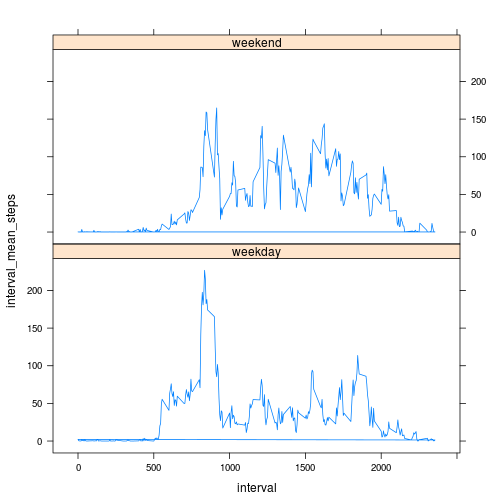

# Exploratory Data Analysis: Assignment 1

## Introduction
This assignment makes use of data from a personal activity monitoring device. This device collects data at 5 minute intervals through out the day. The data consists of two months of data from an anonymous individual collected during the months of October and November, 2012 and include the number of steps taken in 5 minute intervals each day.

## Data
The variables included in this dataset are:

* steps: Number of steps taking in a 5-minute interval (missing values are coded as NA)

* date: The date on which the measurement was taken in YYYY-MM-DD format

* interval: Identifier for the 5-minute interval in which measurement was taken

The dataset is stored in a comma-separated-value (CSV) file from [https://d396qusza40orc.cloudfront.net/repdata%2Fdata%2Factivity.zip]. There are a total of 17,568 observations in this dataset.

## Read the data into R

```r
#set source data file path name
data_file <- "~/coursera/R_data/repdata-data-activity/activity.csv"
#read into R
data <- read.csv(data_file, na.strings = "NA")
#add a date as class date column
data$date2 <- as.Date(data$date, format = "%Y-%m-%d")
```

## Mean Total Steps per Day

```r
hist(by(data$steps,data$date, FUN = sum),breaks=20)
```

 

## Mean and Median Total Number of Steps per Day (ignoring missing values)

```r
mean(by(data$steps,data$date, FUN = sum), na.rm = TRUE)
```

```
## [1] 10766
```

```r
median(by(data$steps,data$date, FUN = sum), na.rm = TRUE)
```

```
## [1] 10765
```

## Average Daily Activity Pattern

```r
#find total number of days
n_days <- length(unique(data$date))
#then plot
plot(by(data$steps/n_days ,data$interval, FUN = sum, na.rm = TRUE), type = "l")
```

 

## Maximum Average Steps per Interval
The interval with the maximum average total steps and the maximum average total number of steps is:

```r
sort(unlist(by(data$steps/n_days ,data$interval, FUN = sum, na.rm = TRUE)), decreasing=TRUE)[1]
```

```
##   835 
## 179.1
```
## Missing Values
The number of records in the data set with a missing value for steps is:

```r
sum(is.na(data$steps))
```

```
## [1] 2304
```
## Filling in missing values
The next code block replaces any missing values for steps with the daily average for that interval.

```r
data_no_nas <- data
#replace NAs in the steps field with the average steps for that interval
data_no_nas$steps <- ifelse(is.na(data$steps),unlist(by(data$steps/n_days ,data$interval, FUN = sum, na.rm = TRUE)),data$steps)
```
## Histogram of the Total Number of Steps per Day
(with missing values for steps replaced with the average steps per interval)

```r
hist(by(data_no_nas$steps,data$date, FUN = sum),breaks=20)
```

 
## Mean and Median Number of Steps per Day
(with missing values for steps replaced with the average steps per interval).
The impact of filling in the missing steps data was to lower the mean and median total steps per day.

```r
mean(by(data_no_nas$steps,data$date, FUN = sum), na.rm = TRUE)
```

```
## [1] 10581
```

```r
median(by(data_no_nas$steps,data$date, FUN = sum), na.rm = TRUE)
```

```
## [1] 10395
```
## Differences in Activity Patterns between Weekdays and Weekends

```r
#add a factor variable for weekend and weekday
data_no_nas$weekendday <- ifelse(weekdays(data_no_nas$date2)=="Sunday"|weekdays(data_no_nas$date2)=="Saturday" ,"weekend","weekday")
```
The following plot shows the average number of steps per interval for weekdays compared to weekend days:

```r
library(lattice)
##first add column of pre-calculated mean values per interval
#(couldn't get this to work in one line, so doing each in turn)
#for weekdays
 data_no_nas$interval_mean_steps[data_no_nas$weekendday == "weekday"] <- by(data_no_nas$steps[data_no_nas$weekendday == "weekday"] ,data$interval[data_no_nas$weekendday == "weekday"], FUN = mean) 
#for weekend days
data_no_nas$interval_mean_steps[data_no_nas$weekendday == "weekend"] <- by(data_no_nas$steps[data_no_nas$weekendday == "weekend"] ,data$interval[data_no_nas$weekendday == "weekend"], FUN = mean) 
##then plot
xyplot(interval_mean_steps ~ interval | weekendday , data_no_nas, type="l", layout = c(1,2))
```

 
